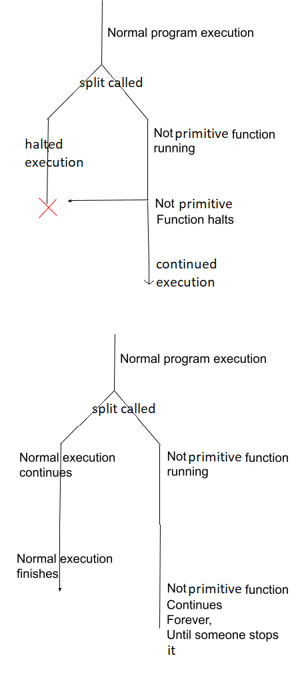

# total_functional_programming_language

# Installation
This is written in python and does not need any external libraries or installations.
To run the program, make sure you have python downloaded and installed. Then download the repo.
To run any code you write, put in python3 Main.py [file_name]    
A repl comes preinstalled which can be opened with python3 Main.py repl.
if you want to load a file and enter repl you can run python3 Main.py [file_name] repl.

# Tutorial
[Language Design Doc](https://docs.google.com/document/d/1RcecCvSwV43WCeCUSMUChC1xEJVVtFZClC1rhoPUaRE/edit?usp=sharing)  
[Development Blog](https://jontedeakin.blogspot.com/)  
#### data type
This language uses unary successor arithmetic (akin to mu-recursive functions). 0 is the base case
and every number is defined as the successor of 0. Successor is written s[0].                 

#### basic functions
Entry starts at a main function called main.           
To define a primitive function the name of the function followed by parenthesis and it's arguments
are written, after this an equals sign is written and the function definition is written.  I.e: test(a,b ) = a;
The function definition can be made of a function call or a variable or a literal. With the
arguments to each function being recursively defined (another function call, variable or literal).       
You can also pattern match on function arguments with successor calls, i.e: minusone(s[a]) = a;     
You can also define a function multiple times, where it will call the highest succeeded matching
definition, ala ml (see definitions in stdlib.tfpl for examples).     

Primitive functions are defined using structural recursion ala coq. Please refer to that system to
understand the restrictions. (note: I have not checked how mutual recursion works in coq or other
		total funcitonal programming languages so, just for now maybe? I have caused
		primitive recursive functions to error when mututal recursion is done).

Totality in the primitive recursive functions are checked against the data type used. Not every
type. You would only need to cover all of the number cases rather than all cases. Currently no other 
type inference / type checking is performed. This will probably just error out. Be careful.

You can also do commenting using /\* and \*/

#### non primitive functions
you can also define non-primitive functions by using {} instead of (). They work identically as
primitive recursive functions with the exception that they don't have to deal with structural
recursion in the same way as primitive recursive functions.
         
One small thing is that you can call a non-primitive function within a primitive function even though, conceptually, this
would create a non-primitive function. This is worked around by the program splitting into two
branches, one where the non-primitive call immediately returns the bottom value (!) and another
where the non-primtive call executes as normal. If the normal execution branch finishes before the
bottom value branch finishes, the bottom value branch is deleted and as are all branches it created.
In practice this does not come up much with purely unary arithmetic. As more functionality is added
this will become more important. Also note: you cannot pattern match bottom in primitive recursive functions.    

#### user defined data
latsly, you can define user defined data using the following syntax.
data TYPE-NAME = CONSTRUCTOR-NAME\[var1, var2, var3, ...] | CONSTRUCTOR-NAME2\[var1, ...] | ...;
There is a shorthand for 0 arity where the square brackets are not needed.
note: you cannot embed data inside itself. i.e: outer\[a, inner\[b], c] will break the interpreter.
the nomenclature of the types in the definition is techincally arbitrary. I plan to fix this later.
But for now, it is purely aesthetic. Although please try to keep to that aesthetic otherwise it
breaks stuff.

#### examples
If you would like further examples please refer to stdlib.tfpl.     
An example of a main function is in test.tfpl.    

#### STDLIB
this is a list of function within the standard library.    
<ol>
	<li> print(a) (prints and returns whatever is passed to it) </li>
	<li> s[a] (returns the successor of the given argument)</li>
	<li> plus(a, b) (performs addition on a and b)</li>
	<li> multiply(a, b) (performs multiplication on a and b)</li>
	<li> power(a, b) (performs power on a and b, a^b)</li>
	<li> pred(a) (returns the predecessor of the given function, note: pred(0) = 0)</li>
	<li> minus(a, b) (returns a-b note: this uses pred so any answer lower than 0 will be 0)</li>
	<li> ack{a, b} (returns the ackerrman function, this is not too useful but is a good example of a non-primitive function)</li>
</ol>

#### FAQ
can the bottom type really be returned explicitly?
	- I have my doubts about this. Although literally it shouldn't return and it doesn't
	technically make sense. I think it works well for the purpose it is employed here. It works
	well enough to ignore the obvious theoretic problems at least.
I am getting infinites in my non-prim functions when using the if function
	- due to time constraints and the like, this language is purely eagerly evalulated. This
	includes the if function. Normally if functions are lazily evaluated to enable proper
	recursion. As of right now i don't have the time to fix it. This will be fixed later but I
	just can't right now. Please be patient.
I am getting non-specific errors about properties of primitive functions
	- This could be a lot of things but one of the ones I think you might run in to is that this
	language has a very strict naming schema. If you use a predefined word anywhere in the code
	at all (variable names, argument names, anything) it should error out. Be careful
